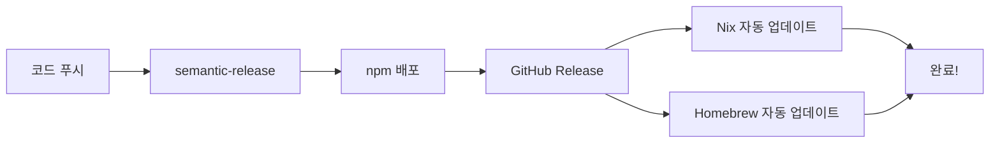

# Homebrew 설정 가이드 (한국어)

## 🎯 목표

사용자들이 이렇게 설치할 수 있게 만들기:
```bash
brew tap tak-bro/aicommit2
brew install aicommit2
```

---

## ✅ 이미 완료된 것들

- [x] Homebrew formula 파일 생성 (Formula/aicommit2.rb)
- [x] **통합 자동 릴리스 워크플로우** (.github/workflows/release.yml)
  - semantic-release 후 **자동으로 Formula 업데이트**
  - **PR 없이 직접 커밋** (즉시 반영!)
- [x] README 업데이트 (설치 방법 추가)
- [x] PAT_TOKEN Secret 설정 완료 (이미 존재)

---

## 🚀 이제 해야 할 것 (단 1가지!)

### homebrew-aicommit2 저장소에 초기 Formula 추가

```bash
# homebrew-aicommit2 저장소로 이동
cd /path/to/homebrew-aicommit2

# Formula 디렉토리 생성
mkdir -p Formula

# aicommit2 저장소에서 파일 복사
cp /path/to/aicommit2/Formula/aicommit2.rb Formula/
cp /path/to/aicommit2/HOMEBREW_TAP_README.md README.md

# 커밋 & 푸시
git add .
git commit -m "feat: initial Homebrew formula for aicommit2 v2.4.11"
git push origin main
```

**이게 끝입니다!** 🎉

---

## 🔄 자동 업데이트 흐름 (완전 자동!)

이제부터는 이렇게 자동으로 진행됩니다:



**상세 흐름**:

1. **개발자가 main에 푸시** (예: `feat: add new feature`)
2. **semantic-release 자동 실행**
   - 버전 결정 (예: 2.5.0)
   - npm에 배포
   - GitHub Release 생성
3. **Homebrew 자동 업데이트** (병렬 실행)
   - npm 레지스트리에서 tarball 다운로드
   - SHA256 계산
   - Formula/aicommit2.rb 자동 업데이트
   - **homebrew-aicommit2에 자동 커밋** (PR 없음!)
4. **완료!** 사용자가 `brew upgrade`로 즉시 사용 가능

### PR이 없어요!

- **이전**: PR 생성 → 수동 리뷰 → 머지 (번거로움 😩)
- **지금**: 자동 커밋 → 즉시 반영 (빠름! 🚀)

모든 자동 커밋은 `[skip ci]` 태그가 있어서 무한 루프가 발생하지 않습니다.

---

## 🧪 테스트하기

### 로컬에서 설치 테스트

```bash
# tap 추가
brew tap tak-bro/aicommit2

# 설치
brew install aicommit2

# 테스트
aicommit2 --version  # 버전 확인
aic2 --help          # aic2 별칭도 동작하는지 확인

# Homebrew 검증
brew test aicommit2
brew audit --strict aicommit2

# 정리 (테스트 끝나면)
brew uninstall aicommit2
brew untap tak-bro/aicommit2
```

### 다음 릴리스 확인

다음 번 main에 푸시할 때:

1. **워크플로우 로그 확인**: https://github.com/tak-bro/aicommit2/actions
2. **Jobs 확인**:
   - ✅ `release`: semantic-release 실행
   - ✅ `update-nix`: flake.nix 자동 업데이트
   - ✅ `update-homebrew`: Formula 자동 업데이트
3. **homebrew-aicommit2 저장소 확인**: 자동 커밋이 push되었는지 확인
4. **로컬 테스트**: `brew upgrade aicommit2`

---

## 📋 체크리스트

완료 여부를 확인하세요:

- [ ] `homebrew-aicommit2/Formula/aicommit2.rb` 파일 존재
- [ ] `homebrew-aicommit2/README.md` 파일 존재
- [x] `PAT_TOKEN` Secret 이미 존재 (재사용)
- [x] 통합 릴리스 워크플로우 설정 완료
- [ ] 다음 릴리스 시 자동 업데이트 확인
- [ ] 로컬에서 `brew install` 테스트 완료
- [ ] `aicommit2 --version` 명령어 동작 확인
- [ ] `aic2 --help` 명령어 동작 확인

---

## 🎯 통합 워크플로우의 장점

### 1. 완전 자동화
- 커밋만 하면 npm, Nix, Homebrew 모두 자동 업데이트
- **PR 리뷰 불필요** (자동 커밋)

### 2. 빠른 릴리스
- **이전**: 릴리스 후 PR 2개 수동 머지 (~10분)
- **지금**: 자동 커밋 (~3분)

### 3. 병렬 실행
- Nix와 Homebrew가 동시에 업데이트
- 시간 절약

### 4. 일관성
- 모든 패키지 매니저가 동일한 버전으로 동기화
- 버전 불일치 없음

---

## 🐛 문제 해결

### Homebrew 업데이트가 안 됨
→ 워크플로우 로그 확인: https://github.com/tak-bro/aicommit2/actions
→ `update-homebrew` job의 에러 메시지 확인

### Formula 설치 시 Node.js 에러
→ `brew install node`로 Node.js 먼저 설치

### "COMMITTER_TOKEN not found" 에러
→ `PAT_TOKEN` Secret이 저장소에 있는지 확인
→ 토큰에 `public_repo`와 `workflow` 권한이 있는지 확인

### sha256 불일치 에러
→ npm 레지스트리가 업데이트될 때까지 대기
→ 보통 릴리스 후 1-2분 소요

---

## 📊 워크플로우 구조

```yaml
# .github/workflows/release.yml

jobs:
  release:
    # semantic-release 실행
    outputs:
      - new_release_published
      - new_release_version

  update-nix:
    needs: release
    # flake.nix 자동 업데이트 & 커밋

  update-homebrew:
    needs: release
    # Formula 자동 업데이트 & 커밋
```

**단일 워크플로우**로 모든 것을 처리합니다!

---

## 🎉 성공 기준

모든 것이 잘 설정되면:

✅ 사용자가 `brew tap tak-bro/aicommit2` 후 `brew install aicommit2`로 설치 가능
✅ 두 명령어 모두 동작: `aicommit2`, `aic2`
✅ 새 릴리스마다 **자동으로** Formula 업데이트됨 (PR 없이!)
✅ `brew test`와 `brew audit` 통과
✅ Nix, Homebrew가 항상 동일한 버전 유지

---

## 📚 참고 자료

- **통합 워크플로우 상세 문서**: `UNIFIED_RELEASE_WORKFLOW.md`
- Homebrew 문서: https://docs.brew.sh/
- Formula 작성 가이드: https://docs.brew.sh/Formula-Cookbook

질문이나 문제가 있으면 GitHub Issues에 올려주세요!
