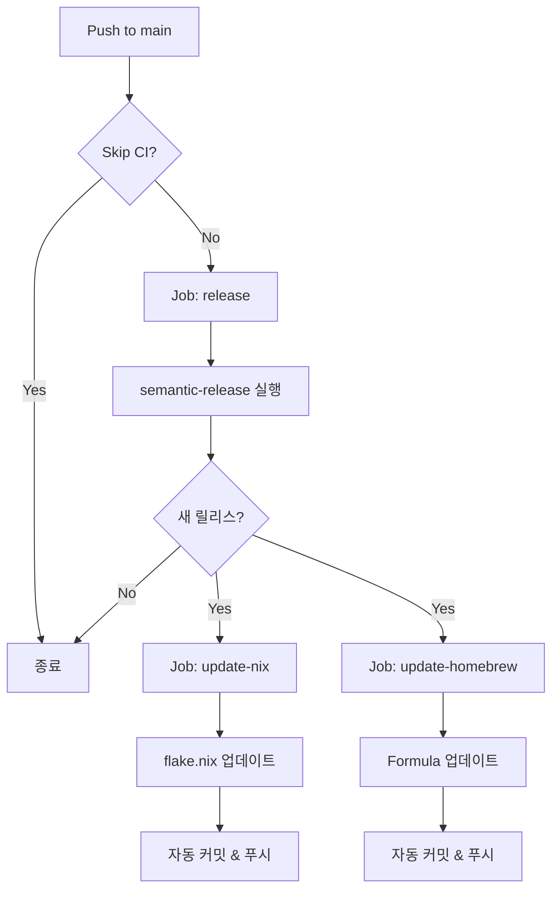

# 통합 릴리스 워크플로우

## 🎯 개요

semantic-release와 함께 Nix, Homebrew를 **자동으로 업데이트**하는 통합 워크플로우입니다.

## ✨ 주요 변경사항

### Before (이전)
```
release.yml → semantic-release만 실행
update_flake.yml → Nix PR 생성 (수동 머지 필요)
update_homebrew.yml → Homebrew PR 생성 (수동 머지 필요)
```

### After (현재)
```
release.yml → semantic-release + Nix/Homebrew 자동 커밋 (한 번에!)
```

## 🔄 워크플로우 구조



## 📋 Jobs 설명

### 1. `release` Job
**목적**: semantic-release 실행 및 버전 정보 전달

- semantic-release로 npm 배포 & GitHub Release 생성
- 새 릴리스 여부와 버전 정보를 output으로 전달
- PAT_TOKEN 사용 (후속 워크플로우 트리거 가능)

**Outputs**:
- `new_release_published`: 'true' 또는 'false'
- `new_release_version`: 새 버전 번호 (예: "2.5.0")

### 2. `update-nix` Job (병렬 실행)
**목적**: flake.nix 자동 업데이트 및 커밋

**실행 조건**: 새 릴리스가 생성된 경우

**동작**:
1. main 브랜치 체크아웃
2. Nix 설치
3. flake.nix의 버전 업데이트
4. 의도적으로 잘못된 해시 주입
5. Nix build 실행 → 올바른 해시 추출
6. 해시 업데이트
7. **자동 커밋 및 푸시** (PR 없음!)

**커밋 메시지**: `chore(nix): update flake.nix to version v{VERSION} [skip ci]`

### 3. `update-homebrew` Job (병렬 실행)
**목적**: Homebrew formula 자동 업데이트 및 커밋

**실행 조건**: 새 릴리스가 생성된 경우

**동작**:
1. homebrew-aicommit2 저장소 체크아웃
2. npm 레지스트리에서 tarball 다운로드
3. SHA256 해시 계산
4. Formula/aicommit2.rb 업데이트
5. **자동 커밋 및 푸시** (PR 없음!)

**커밋 메시지**: `chore: update aicommit2 to {VERSION} [skip ci]`

## 🚀 실행 흐름

### 일반적인 릴리스

```bash
# 1. 개발자가 코드 변경
git add .
git commit -m "feat: add new feature"
git push origin main

# 2. GitHub Actions 자동 실행
# ✅ release job 실행
#    → semantic-release가 버전 분석
#    → 2.5.0으로 릴리스 결정
#    → npm 배포
#    → GitHub Release 생성
#
# ✅ update-nix job 실행 (병렬)
#    → flake.nix를 v2.5.0으로 업데이트
#    → main에 자동 커밋
#
# ✅ update-homebrew job 실행 (병렬)
#    → Formula를 2.5.0으로 업데이트
#    → homebrew-aicommit2에 자동 커밋

# 3. 완료! 모든 패키지 매니저가 동기화됨
```

### Skip CI

```bash
git commit -m "docs: update README [skip ci]"
git push origin main

# → release job이 실행되지 않음
```

## ⚙️ 설정 요구사항

### Secrets
- `PAT_TOKEN`: GitHub Personal Access Token
  - Scopes: `repo`, `workflow`
  - 용도: semantic-release, Nix/Homebrew 저장소 푸시
- `NPM_TOKEN`: npm 배포용 토큰

### Permissions (release.yml에 설정됨)
```yaml
permissions:
  contents: write    # Nix 커밋용
  id-token: write    # npm provenance용
```

## 🔑 핵심 기능

### 1. PR 없이 직접 커밋
- **이전**: PR 생성 → 수동 리뷰 → 머지 (번거로움)
- **현재**: 자동 커밋 → 즉시 반영 (빠름!)

### 2. 병렬 실행
- Nix와 Homebrew 업데이트가 동시에 실행
- 전체 릴리스 시간 단축

### 3. [skip ci] 보호
- 모든 자동 커밋에 `[skip ci]` 태그
- 무한 루프 방지

### 4. 조건부 실행
- 릴리스가 실제로 생성될 때만 업데이트 실행
- 불필요한 워크플로우 실행 방지

## 📊 비교

| 항목 | 이전 | 현재 |
|------|------|------|
| 워크플로우 파일 | 3개 | 1개 |
| 수동 작업 | PR 머지 2회 | 0회 |
| 릴리스 후 대기 시간 | ~10분 (PR 리뷰) | ~3분 (자동) |
| 실행 방식 | 순차 (release → nix → homebrew) | 병렬 (nix + homebrew) |
| 에러 발생 시 | PR에서 확인 | 워크플로우 로그에서 확인 |

## 🐛 트러블슈팅

### Nix 업데이트 실패
```bash
# 로그 확인
https://github.com/tak-bro/aicommit2/actions

# 일반적인 원인:
# 1. 해시 추출 실패 → Nix build 출력 확인
# 2. 버전 형식 오류 → semantic-release 설정 확인
```

### Homebrew 업데이트 실패
```bash
# 일반적인 원인:
# 1. SHA256 계산 실패 → npm 레지스트리 확인
# 2. sed 패턴 매칭 실패 → Formula 형식 확인
# 3. 푸시 권한 없음 → PAT_TOKEN 확인
```

### semantic-release가 새 버전 생성 안 함
```bash
# 커밋 메시지 확인
git log --oneline -10

# conventional commit 형식 필요:
# ✅ feat: new feature
# ✅ fix: bug fix
# ❌ update code (no type prefix)
```

## 🧪 테스트 방법

### 로컬에서 커밋 메시지 시뮬레이션
```bash
# 1. feature 커밋 (patch 릴리스)
git commit -m "feat: add test feature"

# 2. Push (dry-run으로 확인 가능)
git push --dry-run origin main
```

### 워크플로우 로그 확인
```bash
# GitHub Actions 페이지
https://github.com/tak-bro/aicommit2/actions

# 각 job의 로그 확인:
# - release: semantic-release 출력
# - update-nix: flake.nix 변경사항
# - update-homebrew: Formula 변경사항
```

## 📝 유지보수

### 워크플로우 수정 시
1. `.github/workflows/release.yml` 편집
2. 변경사항 커밋 (`chore: update workflow [skip ci]`)
3. 푸시 후 다음 릴리스에서 자동 적용

### Homebrew Formula 템플릿 변경 시
1. `homebrew-aicommit2/Formula/aicommit2.rb` 수정
2. `release.yml`의 sed 패턴도 함께 업데이트
3. 정규식 테스트 필수!

## 🎉 장점

1. **완전 자동화**: 커밋 → 릴리스 → 패키지 업데이트 (사람 개입 0)
2. **빠른 릴리스**: PR 대기 시간 제거
3. **일관성**: 모든 패키지 매니저가 동일한 버전으로 동기화
4. **유지보수 간편**: 하나의 워크플로우 파일만 관리
5. **병렬 실행**: 시간 절약

## 🔮 향후 개선 가능성

- [ ] AUR (Arch User Repository) 자동 업데이트 추가
- [ ] Scoop (Windows) 자동 업데이트 추가
- [ ] Chocolatey (Windows) 자동 업데이트 추가
- [ ] 릴리스 노트에 패키지 매니저 링크 자동 추가
- [ ] Slack/Discord 알림 통합

---

**참고**: 이 워크플로우는 `PAT_TOKEN`이 올바르게 설정되어 있어야 동작합니다.
